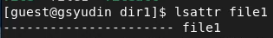
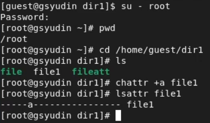
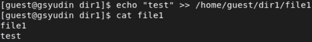
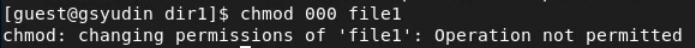
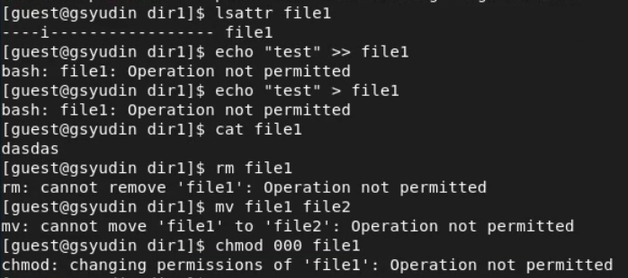

---
# Front matter
title: "Лабораторная работа 4"
author: "Юдин Герман Станиславович, НФИбд-01-19"

# Generic otions
lang: ru-RU
toc-title: "Содержание"

# Bibliography
bibliography: bib/cite.bib
csl: pandoc/csl/gost-r-7-0-5-2008-numeric.csl

# Pdf output format
toc: true # Table of contents
toc_depth: 2
lof: true # List of figures
lot: true # List of tables
fontsize: 12pt
linestretch: 1.5
papersize: a4
documentclass: scrreprt
## I18n
polyglossia-lang:
  name: russian
  options:
	- spelling=modern
	- babelshorthands=true
polyglossia-otherlangs:
  name: english
### Fonts
mainfont: PT Serif
romanfont: PT Serif
sansfont: PT Sans
monofont: PT Mono
mainfontoptions: Ligatures=TeX
romanfontoptions: Ligatures=TeX
sansfontoptions: Ligatures=TeX,Scale=MatchLowercase
monofontoptions: Scale=MatchLowercase,Scale=0.9
## Biblatex
biblatex: true
biblio-style: "gost-numeric"
biblatexoptions:
  - parentracker=true
  - backend=biber
  - hyperref=auto
  - language=auto
  - autolang=other*
  - citestyle=gost-numeric
## Misc options
indent: true
header-includes:
  - \linepenalty=10 # the penalty added to the badness of each line within a paragraph (no associated penalty node) Increasing the value makes tex try to have fewer lines in the paragraph.
  - \interlinepenalty=0 # value of the penalty (node) added after each line of a paragraph.
  - \hyphenpenalty=50 # the penalty for line breaking at an automatically inserted hyphen
  - \exhyphenpenalty=50 # the penalty for line breaking at an explicit hyphen
  - \binoppenalty=700 # the penalty for breaking a line at a binary operator
  - \relpenalty=500 # the penalty for breaking a line at a relation
  - \clubpenalty=150 # extra penalty for breaking after first line of a paragraph
  - \widowpenalty=150 # extra penalty for breaking before last line of a paragraph
  - \displaywidowpenalty=50 # extra penalty for breaking before last line before a display math
  - \brokenpenalty=100 # extra penalty for page breaking after a hyphenated line
  - \predisplaypenalty=10000 # penalty for breaking before a display
  - \postdisplaypenalty=0 # penalty for breaking after a display
  - \floatingpenalty = 20000 # penalty for splitting an insertion (can only be split footnote in standard LaTeX)
  - \raggedbottom # or \flushbottom
  - \usepackage{float} # keep figures where there are in the text
  - \floatplacement{figure}{H} # keep figures where there are in the text
---

<h1 align="center">

РОССИЙСКИЙ УНИВЕРСИТЕТ ДРУЖБЫ НАРОДОВ 

Факультет физико-математических и естественных наук  

Кафедра прикладной информатики и теории вероятностей

ОТЧЕТ ПО ЛАБОРАТОРНОЙ РАБОТЕ №4
  
<h2 align="right">

дисциплина: Информационная безопасность

Преподователь: Кулябов Дмитрий Сергеевич

Студент: Юдин Герман Станиславович

Группа: НФИбд-01-19
  
  
<h1 align="center">

МОСКВА

2022 г.
</h1>

# **Цель работы**

Получение практических навыков работы в консоли с расширенными атрибутами файлов.

# **Теоретическое введение**

lsattr - отображает расширенные атрибуты файлов/директорий

chattr - изменяет расширенные атрибуты на файле/директории

# **Выполнение лабораторной работы**

1. Посмотрел расширенные атрибуты файла file1, они оказались пустыми (Рис [@fig:1]).

{ #fig:1 width=90% }

2. Установил права 600 на файл.

3. Попытался изменить расширенные атрибуты файла от имени guest. В ответ получил ошибку (Рис [@fig:2]).

{ #fig:2 width=90% }

4. Зашёл из-под root и изменил атрибуты. Всё успешно поменялось (Рис [@fig:3]). Атрибут a не даёт перезаписать файл, можно только дозаписать.

{ #fig:3 width=90% }

5. Проверил дозапись в файл, все работает (Рис [@fig:4]).

{ #fig:4 width=90% }

6. При этом перезапись файла, удаление или переименовывание файла не работает (Рис [@fig:5]).

{ #fig:5 width=90% }

7. Изменить права на файл также нельзя (Рис [@fig:6]).

{ #fig:6 width=90% }

8. Когда я убрал расширенный атрибут, то снова смог делать с файлом, всё что хотел.

9. Проверил то же самое с атрибутом i (Рис [@fig:7]). Данный атрибут не даёт менять файл, в том числе нельзя удалять файл.

{ #fig:7 width=90% }

# Вывод

Выполнив данную лабораторную работу, я ознакомился с расширенными атрибутами файлов, а именно a и i, первый позволяет дозаписывать файл, а второй не позволяет менять файл совсем.

# Список литературы

1. Кулябов, Д.С. - Лабораторная работа № 4. Дискреционное разграничение прав в Linux. Расширенные атрибуты
https://esystem.rudn.ru/pluginfile.php/1651887/mod_resource/content/3/004-lab_discret_extattr.pdf
