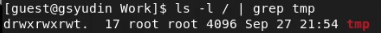
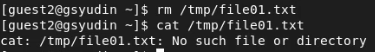

---
# Front matter
title: "Лабораторная работа 5"
author: "Юдин Герман Станиславович, НФИбд-01-19"

# Generic otions
lang: ru-RU
toc-title: "Содержание"

# Bibliography
bibliography: bib/cite.bib
csl: pandoc/csl/gost-r-7-0-5-2008-numeric.csl

# Pdf output format
toc: true # Table of contents
toc_depth: 2
lof: true # List of figures
lot: true # List of tables
fontsize: 12pt
linestretch: 1.5
papersize: a4
documentclass: scrreprt
## I18n
polyglossia-lang:
  name: russian
  options:
	- spelling=modern
	- babelshorthands=true
polyglossia-otherlangs:
  name: english
### Fonts
mainfont: PT Serif
romanfont: PT Serif
sansfont: PT Sans
monofont: PT Mono
mainfontoptions: Ligatures=TeX
romanfontoptions: Ligatures=TeX
sansfontoptions: Ligatures=TeX,Scale=MatchLowercase
monofontoptions: Scale=MatchLowercase,Scale=0.9
## Biblatex
biblatex: true
biblio-style: "gost-numeric"
biblatexoptions:
  - parentracker=true
  - backend=biber
  - hyperref=auto
  - language=auto
  - autolang=other*
  - citestyle=gost-numeric
## Misc options
indent: true
header-includes:
  - \linepenalty=10 # the penalty added to the badness of each line within a paragraph (no associated penalty node) Increasing the value makes tex try to have fewer lines in the paragraph.
  - \interlinepenalty=0 # value of the penalty (node) added after each line of a paragraph.
  - \hyphenpenalty=50 # the penalty for line breaking at an automatically inserted hyphen
  - \exhyphenpenalty=50 # the penalty for line breaking at an explicit hyphen
  - \binoppenalty=700 # the penalty for breaking a line at a binary operator
  - \relpenalty=500 # the penalty for breaking a line at a relation
  - \clubpenalty=150 # extra penalty for breaking after first line of a paragraph
  - \widowpenalty=150 # extra penalty for breaking before last line of a paragraph
  - \displaywidowpenalty=50 # extra penalty for breaking before last line before a display math
  - \brokenpenalty=100 # extra penalty for page breaking after a hyphenated line
  - \predisplaypenalty=10000 # penalty for breaking before a display
  - \postdisplaypenalty=0 # penalty for breaking after a display
  - \floatingpenalty = 20000 # penalty for splitting an insertion (can only be split footnote in standard LaTeX)
  - \raggedbottom # or \flushbottom
  - \usepackage{float} # keep figures where there are in the text
  - \floatplacement{figure}{H} # keep figures where there are in the text
---

<h1 align="center">

РОССИЙСКИЙ УНИВЕРСИТЕТ ДРУЖБЫ НАРОДОВ 

Факультет физико-математических и естественных наук  

Кафедра прикладной информатики и теории вероятностей

ОТЧЕТ ПО ЛАБОРАТОРНОЙ РАБОТЕ №5
  
<h2 align="right">

дисциплина: Информационная безопасность

Преподователь: Кулябов Дмитрий Сергеевич

Студент: Юдин Герман Станиславович

Группа: НФИбд-01-19
  
  
<h1 align="center">

МОСКВА

2022 г.
</h1>

# **Цель работы**

Изучение механизмов изменения идентификаторов, применения SetUID- и Sticky-битов. Получение практических навыков работы в консоли с дополнительными атрибутами. Рассмотрение работы механизма смены идентификатора процессов пользователей, а также влияние бита Sticky на запись и удаление файлов.

# **Теоретическое введение**

Setuid – это бит разрешения, который позволяет пользователю запускать исполняемый файл с правами владельца этого файла.

Принцип работы Setgid очень похож на setuid с отличием, что файл будет запускаться пользователем от имени группы, которая владеет файлом.

Последний специальный бит разрешения – это Sticky Bit . В случае, если этот бит установлен для папки, то файлы в этой папке могут быть удалены только их владельцем.

# **Выполнение лабораторной работы**

1. Создал файл simpleid.c, который скомпилировал и запустил. Выполнил команду id и сравнил вывод. Вывело одинаковую информацию (Рис [@fig:1]).

{ #fig:1 width=90% }

2. Усложнил программу в файле simpleid2.c, также скомпилировал и запустил (Рис [@fig:2]). На этот раз выдаёт две идентификатора пользователя и 2 идентификатора группы.

{ #fig:2 width=90% }

3. От имени суперпользователя изменил владельца файла на рута и добавил S бит на пользователя (Рис [@fig:3]). Проверил корректность установленного бита (Рис [@fig:4]).

{ #fig:3 width=90% }

{ #fig:4 width=90% }

4. При запуске от guest выдаёт следующую информацию. Здесь мы видим, что e_uid стал 0 (Рис [@fig:5]), что означает, что файл запустился от имени владельца, то есть root.

{ #fig:5 width=90% }

5. Создал новый файл readfile.c, который предназначен для чтения файлов (Рис [@fig:6]). Сделал так, чтобы другой файл мог проитать root, но не мог guest (Рис [@fig:7]).

{ #fig:6 width=90% }

{ #fig:7 width=90% }

6. Попытался прочитать с guest, но доступ закрыт (Рис [@fig:8] и [@fig:9]). 

{ #fig:8 width=90% }

{ #fig:9 width=90% }

7. Сменил владельца файла и установил SetU’D-бит (Рис [@fig:10]). На этот раз от пользователя guest имеется доступ ко всем файлам, к которым есть доступ у root (Рис [@fig:11]). Set биты позволяют делать действия относительно владельца файла, то есть файлы запускаются от лица владельца файла, и если владелец может прочитать какой-то файл, а тот кто запускает нет, то с помощью set бита есть возможность прочитать файл даже у пользователя не имеющего возможности прочитать данный файл.

{ #fig:10 width=90% }

{ #fig:11 width=90% }

8. Посмотерл атрибуты на каталоге /tmp (Рис [@fig:12]).

{ #fig:12 width=90% }

9. Создал в данном каталоге файл от пользователя guest (Рис [@fig:13]).

{ #fig:13 width=90% }

10. Посмотрел атрибуты у только что созданного файла и разрешил чтение и запись для категории пользователей «все остальные» (Рис [@fig:14]).

{ #fig:14 width=90% }

11. От пользователя guest2 попробовал дозаписать файл. Попробовал перезаписать файл. Все действия выполнились (Рис [@fig:15]).

{ #fig:15 width=90% }

12. Попробовал удалить файл (Рис [@fig:16]).

{ #fig:16 width=90% }

13. От прав администратора снял t бит с директории /tmp (Рис [@fig:17]).

{ #fig:17 width=90% }

14. Повторил предыдущие шаги от guest2. На этот раз смог удалить файл (Рис [@fig:18]).

{ #fig:18 width=90% }

15. Вернул t бит обратно.

# Вывод

Выполнив данную лабораторную работу, я изучил механизмы изменения идентификаторов, применения SetUID- и Sticky-битов, получил практические навыки работы в консоли с дополнительными атрибутами, рассмотрел работу механизма смены идентификатора процессов пользователей, а также влияние бита Sticky на запись и удаление файлов.

# Список литературы

1. Кулябов, Д.С. - Лабораторная работа № 5. Дискреционное разграничение прав в Linux. Исследование влияния дополнительных атрибутов https://esystem.rudn.ru/pluginfile.php/1651889/mod_resource/content/2/005-lab_discret_sticky.pdf
