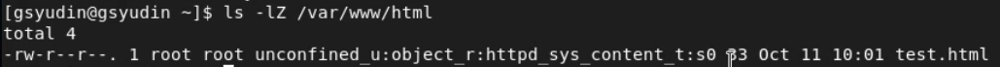

---
# Front matter
title: "Лабораторная работа 6"
author: "Юдин Герман Станиславович, НФИбд-01-19"

# Generic otions
lang: ru-RU
toc-title: "Содержание"

# Bibliography
bibliography: bib/cite.bib
csl: pandoc/csl/gost-r-7-0-5-2008-numeric.csl

# Pdf output format
toc: true # Table of contents
toc_depth: 2
lof: true # List of figures
lot: true # List of tables
fontsize: 12pt
linestretch: 1.5
papersize: a4
documentclass: scrreprt
## I18n
polyglossia-lang:
  name: russian
  options:
	- spelling=modern
	- babelshorthands=true
polyglossia-otherlangs:
  name: english
### Fonts
mainfont: PT Serif
romanfont: PT Serif
sansfont: PT Sans
monofont: PT Mono
mainfontoptions: Ligatures=TeX
romanfontoptions: Ligatures=TeX
sansfontoptions: Ligatures=TeX,Scale=MatchLowercase
monofontoptions: Scale=MatchLowercase,Scale=0.9
## Biblatex
biblatex: true
biblio-style: "gost-numeric"
biblatexoptions:
  - parentracker=true
  - backend=biber
  - hyperref=auto
  - language=auto
  - autolang=other*
  - citestyle=gost-numeric
## Misc options
indent: true
header-includes:
  - \linepenalty=10 # the penalty added to the badness of each line within a paragraph (no associated penalty node) Increasing the value makes tex try to have fewer lines in the paragraph.
  - \interlinepenalty=0 # value of the penalty (node) added after each line of a paragraph.
  - \hyphenpenalty=50 # the penalty for line breaking at an automatically inserted hyphen
  - \exhyphenpenalty=50 # the penalty for line breaking at an explicit hyphen
  - \binoppenalty=700 # the penalty for breaking a line at a binary operator
  - \relpenalty=500 # the penalty for breaking a line at a relation
  - \clubpenalty=150 # extra penalty for breaking after first line of a paragraph
  - \widowpenalty=150 # extra penalty for breaking before last line of a paragraph
  - \displaywidowpenalty=50 # extra penalty for breaking before last line before a display math
  - \brokenpenalty=100 # extra penalty for page breaking after a hyphenated line
  - \predisplaypenalty=10000 # penalty for breaking before a display
  - \postdisplaypenalty=0 # penalty for breaking after a display
  - \floatingpenalty = 20000 # penalty for splitting an insertion (can only be split footnote in standard LaTeX)
  - \raggedbottom # or \flushbottom
  - \usepackage{float} # keep figures where there are in the text
  - \floatplacement{figure}{H} # keep figures where there are in the text
---

<h1 align="center">

РОССИЙСКИЙ УНИВЕРСИТЕТ ДРУЖБЫ НАРОДОВ 

Факультет физико-математических и естественных наук  

Кафедра прикладной информатики и теории вероятностей

ОТЧЕТ ПО ЛАБОРАТОРНОЙ РАБОТЕ №6
  
<h2 align="right">

дисциплина: Информационная безопасность

Преподователь: Кулябов Дмитрий Сергеевич

Студент: Юдин Герман Станиславович

Группа: НФИбд-01-19
  
  
<h1 align="center">

МОСКВА

2022 г.
</h1>

# **Цель работы**

Развить навыки администрирования ОС Linux. Получить первое практическое знакомство с технологией SELinux.
Проверить работу SELinx на практике совместно с веб-сервером Apache.

# **Выполнение лабораторной работы**

1. Убедился, что SELinux работает в режиме enforcing (Рис [@fig:1]).

{ #fig:1 width=90% }

2. Проверил, что httpd работает (Рис [@fig:2]).

{ #fig:2 width=90% }

3. Нашел контекст безопасность httpd - это system_u:system_r:httpd_t:s0 (Рис [@fig:3]).

{ #fig:3 width=90% }

4. Посмотрел текущее состояние переключателей SELinux для Apache (Рис [@fig:4]).

{ #fig:4 width=90% }

5. Посмотрел статистику по политике (Рис [@fig:5]). Количество пользователей - 8, ролей - 14, типов - 5002.

{ #fig:5 width=90% }

6. Тип файлов у /var/www - это директории, который на данный момент пустые (Рис [@fig:6]). Файлов никаких нет. Только root может менять данную директорию .

{ #fig:6 width=90% }

7. Создал тестовый файл для вывода на сайте (Рис [@fig:7]).

{ #fig:7 width=90% }

8. Проверил контекст созданного файла, он оказался unconfined_u:object_r:httpd_sys_content_t:s0 (Рис [@fig:8]).

{ #fig:8 width=90% }

9. Убедился в корректности работы системы (Рис [@fig:9]).

{ #fig:9 width=90% }

10. Сменил контекст безопасности на не связанный с httpd (Рис [@fig:10]).

{ #fig:10 width=90% }

11. После этого возникла ошибка (Рис [@fig:11]).

{ #fig:11 width=90% }

12. Далее идёт настройка портов, но так как у меня 81 изначально добавлен (Рис [@fig:12]), то я не могу его добавить снова. Поэтому и сайт работает с самого начала (Рис [@fig:13]), когда мы меняет порт на 81. Удалить порт также нельзя.

{ #fig:12 width=90% }

{ #fig:13 width=90% }

# Вывод

Выполнив данную лабораторную работу, я развил навыки администрирования ОС Linux, получил первое практическое знакомство с технологией SELinux и проверил работу SELinx на практике совместно с веб-сервером Apache.

# Список литературы

1. Кулябов, Д.С. - Лабораторная работа № 6. Мандатное разграничение прав в Linux https://esystem.rudn.ru/pluginfile.php/1651891/mod_resource/content/2/006-lab_selinux.pdf
